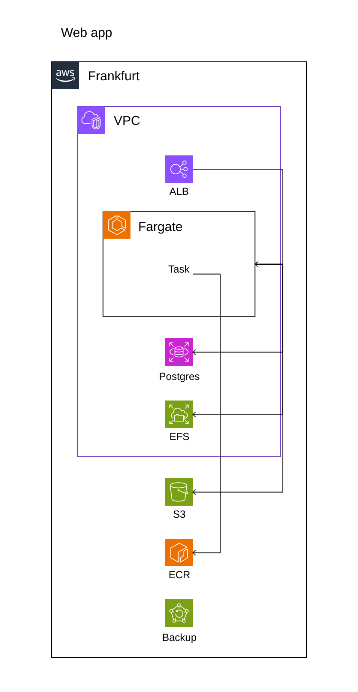
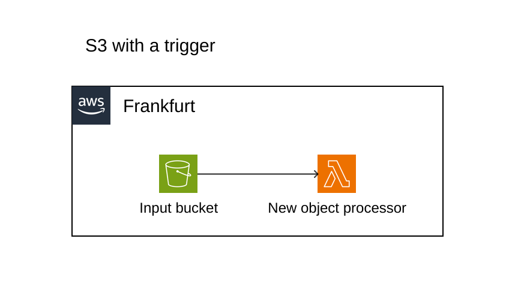

# LARC. Language for architecture


Larc is a set of domain specific languages that enable software architecture definition, visualisation and validation against the Infrastructure as Code.

## The elefant 
Why not structurizr?

In short, structurizr is about creating diagrams using [C4 model](structurizr), while Larc is about describing, maintaining and validating architecture. Visualisation in Larc is important, but secondary. In a way, Larc is an experiment to see what could be the next step after structurizr.

# Why?

One big issue with architecture diagrams is that they are just that. Good to explain an idea, often forgotten as the implementation goes on. While I really like the idea of [Architecture as/from Code](https://architectelevator.com/cloud/iac-ifc-trends/), I see projects where [CDK](https://docs.aws.amazon.com/cdk/v2/guide/home.html) or [Winglang](https://www.winglang.io/) are not applicable. It could be that the team is more comfortable with plain Terraform, or the architect is "shared" or even is a customer/product owner of the team implementing the infrastructure. One thing is guaranteed, though. Any untrivial project will see its architecture change during the implementation. The changes need to be communicated in any direction, agreed upon, validated and reflected in the documentation. 

For this Larc has several components.

# Larc

The starting point in describing architecture. Levels 1 (System context) and 2 (Container) in C4 model.

Here's an example of a modern 3-tier web application running in a container environment.
```
architecture "Web app" {
    AWS Frankfurt {
        VPC {
            ALB
            ECS Fargate {
                Task [ count "0+" ]
            }
            RDS Postgres
            EFS
        }

        S3

        ECR
        Backup
    }
}

relations {
    ALB -> ECS

    ECS -> RDS
    ECS -> EFS
    ECS -> S3

    Task <- ECR
}
```
Something like this:


At this stage, there's no visualisation, just a description of components and their implicit (nested or contained) or explicit relationships. 

Do note, this rather liberally mixes levels 1 and 2 of the C4. If one desires, this could be rewritten as
```
architecture "Web app" {
    [ c4 "System context" ]

    person

    softwareSystem  
}

relations {
    person -> softwareSystem [ kind "Uses" ]
}
```

```
architecture "Web app" {
    [ c4 "Component" ]

    softwareSystem {
        LoadBalancer
        ContainerRuntime {
            Instance [ count "0+" ]
        }
        RDBMS
        NFS

        ObjectStore
        
        Registry
        Backup
    }
}

relations {
    LoadBalancer -> ContainerRuntime

    ContainerRuntime -> RDBMS
    ContainerRuntime -> NFS
    ContainerRuntime -> ObjectStore

    ContainerRuntime <- Registry
}
```  

```
architecture "Web app" {
    [ c4 "Deployment environment" ]

    softwareSystem {
        AWS Frankfurt {
            VPC {
                LoadBalancer {
                    ALB
                }
                ContainerRuntime {
                    ECS Fargate {
                        Instance {
                            Task
                        }
                    }
                }
                RDBMS {
                    RDS Postgres
                }
                NFS {
                    EFS
                }
            }

            ObjectStore {
                S3
            }
            
            Registry {
                ECR
            }

            Backup {
                AWS Backup
            }
        }
    }
}
```

It's doable, but... feels unnecessary.

# Sharc

Sharc is a DSL that, combined with an architecture definition, controls visual representation of an architecture.

Let's take a simple architecture `./doc/s3-trigger.arc`
```
architecture "S3 with a trigger" {
    AWS "Frankfurt" {
        S3 "Input bucket"
        Lambda "New object processor"
    }
}
relations {
    S3 -> Lambda [ trigger "new object" ]
}
```

And then an `./doc/s3-trigger.sharc`

```
architecture "./doc/s3-trigger.arc"

layout {

    Lambda [
        right anchor(S3:right)
    ]
}
```

Should render this:


# Barc

Barc is a DSL that links (binds) a Larc document to Terraform. This allows identifying when architecture definition and infrastructure have diverged.

TODO. 